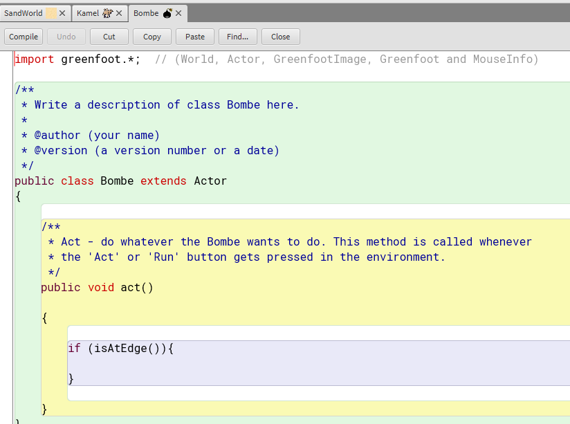

# Informatikprojekt
### Inhaltsverzeichnis
<li><a href="#kapitel1">1. Stundenprotokolle</a></h2></li>

Genauer

    
  <li><a href="#kapitel1.1">10.01.2023</a></h3></li>
  <li><a href="#kapitel1.2">11.01.2023</a></h3></li>
  <li><a href="#kapitel1.3">17.01.2023</a></h3></li>
  <li><a href="#kapitel1.4">18.01.2023</a></h3></li>
  <li><a href="#kapitel1.5">24.01.2023</a></h3></li>
  <li><a href="#kapitel1.6">25.01.2023</a></h3></li>
  <li><a href="#kapitel1.7">31.01.2023</a></h3></li>
  <li><a href="#kapitel1.8">01.02.2023</a></h3></li>
  <li><a href="#kapitel1.9">08.02.2023</a></h3></li>
  <li><a href="#kapitel1.10">10.02.2023</a></h3></li>
  <li><a href="#kapitel1.11">15.02.2023</a></h3></li>
  <li><a href="#kapitel1.12">17.02.2023</a></h3></li>
  <li><a href="#kapitel1.13">22.02.2023</a></h3></li>
  <li><a href="#kapitel1.14">24.02.2023</a></h3></li>
  <li><a href="#kapitel1.15">01.03.2023</a></h3></li>
  <li><a href="#kapitel1.16">03.03.2023</a></h3></li>
  <li><a href="#kapitel1.17">08.03.2023</a></h3></li>
  <li><a href="#kapitel1.18">10.03.2023</a></h3></li>
  <li><a href="#kapitel1.19">15.03.2023</a></h3></li>
  <li><a href="#kapitel1.20">17.03.2023</a></h3></li>
  <li><a href="#kapitel1.21">22.03.2023</a></h3></li>
  <li><a href="#kapitel1.22">24.03.2023</a></h3></li>
  <li><a href="#kapitel1.23">29.03.2023</a></h3></li>
  <li><a href="#kapitel1.24">31.03.2023</a></h3></li>
  <li><a href="#kapitel1.25">05.04.2023</a></h3></li>

<li><a href="https://github.com/Jana894/Projektseite-2.-Halbjahr/blob/main/README.md">2. Projektseite</a></h2></li>

<h2 id="kapitel1">1. Stundenprotokolle</h2>

<h3 id="kapitel1.1">10.01.2023</h3>
Heute haben wir die Noten für unser Halbjahresprojekt zurückbekommen und hatten am Ende der Stunde noch 20 Minuten Zeit, um uns zu überlegen, woran wir im nächsten Halbjahr arbeiten  möchten. Hierfür haben wir, da eine Steigerung in die Projekten zu finden sein soll, "Greenfoot" installiert und ein paar Dinge ausprobiert, konnten jedoch nocht nicht viel machen, da die Stunde schnell vorbei war.

<h3 id="kapitel1.2">11.01.2023</h3>
Heute haben wir uns weiter mit "Greenfoot" beschäftigt und uns von Herrn Buhl die Grundlagen erklären lassen. Zudem haben wir ein Buch über "Greenfoot" bekommen, um anhand dieses das Programm verstehen zu können und die Programmiersprache "Java". Nachdem wir uns überlegt haben, dass unser Spiel in der Wüste stattfinden soll und sich unsere Figur (ein Kamel) durch ein Labyrinth von Kakteen bewegen soll und ein Leben verliert, sobald ein Kaktus berührt wird, haben wir die einzelnen Figuren unter "actors" aufgeführt und benannt.
Mit der Programmierung des Kamels haben wir ebenfalls begonnen, wobei wir jedoch ein Problem damit hatten, den Befehl in "Java" richtig zu formulieren, womit uns Luca dann geholfen und den Tipp gegeben hat, auf der Greenfoot-Seite die Tutorials zur Arbeit mit "Greenfoot" anzuschauen.

Arbeit mit Greenfoot

[Homepage-Greenfoot](https://www.greenfoot.org/doc)
  

<h3 id="kapitel1.3">17.01.2023</h3>
Heute haben wir uns weiter in "Greenfoot" eingearbeitet und es am Ende sogar geschafft, zu Programmieren, dass unsere Figur (Kamel) das Fass mit Wasser  trinkt, wobei dieses dann verschwindet. Außerdem können wir unser Kamel nach rechts und links bewegen und müssen nun noch programmieren, wie es sich ein wenig drehen kann, um durch das Kaktus-Labyrinth zu kommen. 
Unser Plan ist es, dass sich das Kamel durch das Labyrinth aus Kakteen bewegt und zwei Leben hat. Berührt das Kamel einen Kaktus oder wird von einem herumfliegenden Känguru getroffen, verliert es ein Leben. Durch das Trinken aus dem Fass mit Wasser kann ein Leben zurückgewonnen werden. Auch in diesem 2D-Spiel soll es wie in unserem anderen Projekt möglich sein, wenn man mit dem Kamel den Rand der Ebene erreicht, dass eine neue Ebene erscheint. Hinzu kommt, dass es noch eine Bombe gibt, die zu einem zufälligen Zeitpunkt auftaucht und wenn sie das Kamel trifft, ist dieses tot und man hat verloren. Ein Ziel des Kamels haben wir uns noch nicht überlegt, sind uns aber auch noch nicht sicher, ob wir unseren Plan so umsetzen können, wie wir aktuell denken, da uns das Einarbeiten in "Greenfoot" doch einiges an Zeit kostet.

Arbeit mit Greenfoot

**Entwurf des Layouts**
    

**Programmierung Tastatursteuerung Kamel und FassMitWasser "essen"**
    

<h3 id="kapitel1.4">18.01.2023</h3>
Heute haben wir uns weiter in "Greenfoot" eingearbeitet und es am Ende geschafft, unser Kamel mit den Tasten "a", "d", "s" und "w" durch das Labyrinth aus Kakteen zu bewegen. Leider haben wir uns damit fast die gesamte Doppelstunde aufgehalten, nachdem wir vergebens versucht haben, dass das Kamel, wenn es einen Kaktus berührt ein Leben verliert. Unser Gedanke hierfür war eigentlich, dass wir eine ähnliche Programmierung vornehen, wie wenn es aus dem Fass mit Wasser trinkt, jedoch haben wir es nicht geschafft, dass wenn das Kamel einen Kaktus berührt, dass ein roter Punkt, der die Leben darstellen soll, verschwindet.

Arbeit mit Greenfoot

**Programmierung Erschaffung der Welt und Platzierung der Objekte**

    

**Programmierung vollständige Tastatursteuerung**

<h3 id="kapitel1.5">24.01.2023</h3>
Heute haben wir uns zunächst überlegt, dass es doch etwas unrealistisch ist, dass Kängurus durch die Luft fliegen, weshalb wir diese durch Spinnen ersetzt haben. Außerdem haben wir uns mit dem Problem von letzter Woche beschäftigt, jedoch immer noch keine Lösung gefunden. Auch die Tutorials von Greenfoot auf deren Seite, das Greenfoot Buch und mögliche Ideen von Luca konnten uns nicht weiterhelfen, weshalb wir aktuell an einem Punkt sind, wo wir nicht voran kommen. Hoffentlich hat Herr Buhl morgen eine Idee, wie wir weiter kommen beziehungsweise unseren Code ändern müssen, damit wir dieses Problem beheben können. 

Arbeit mit Greenfoot

Problem (mit roten Kreuzen markiert)
    

<h3 id="kapitel1.6">25.01.2023</h3>
Heute haben wir uns erneut mit unserem Problem der letzten Stunde beschäftigt und haben mit der Hilfe von Herrn Buhl unseren Denkfehler gefunden. Wir werden auch immer vertrauter mit "Greenfoot" und dem Prinzip hinter Java. 
Wir habne eine ArrayList programmiert, damit unsere Leben zusammengefasst sind und wir dann vom Kamel auf die ArrayList in der SandWorld zugreifen können, damit ein LebenVomKamel verschwindet, wenn unser Kamel einen Kaktus berührt.

Arbeit mit Greenfoot

**ArrayList für LebenVomKamel und Programmierung Entfernen der LebenVomKamel bei Berührung der Kakteen**
    

    

    

<h3 id="kapitel1.7">31.01.2023</h3>
Leider ließ sich heute unser gesamtes Projekt nicht mehr öffnen und wir mussten von letzter Stunde alles neu machen. Dabei traten so viele Schwierigkeiten auf, dass wir am Ende der Stunde weder vor noch zurück kamen, weshalb uns Herr Buhl erneut weitergeholfen hat, damit wir unser Projekt überhaupt speichern konnten.

Arbeit mit Greenfoot

**Zusammenfassung/Vereinfachung der bisherigen Programmierungen**

**Programmierung Entfernen der LebenVomKamel**
    

<h3 id="kapitel1.8">01.02.2023</h3>
Heute haben wir unsere Kakteen umplatziert, da das Kamel seine Leben schon verliert, wenn es nah an die Kakteen herankommt und sie nicht zwingend berührt. Anschließend haben wir unsere Programmierung der SandWorld übersichtlicher gemacht und angefangen zu programmieren, dass unser Kamel seine verlorenen Leben zurückerhält, wenn es aus dem FassMitWasser "trinkt". Leider sind wir hierbei noch nicht zu einem endgültigen Ergebnis gekommen und werden dort nächte Stunde weiter arbeiten.

Arbeit mit Greenfoot

**Zusammenfassung/Vereinfachung der bisherigen Programmierungen**

**Programmierung Heilung der LebenVomKamel**
    

<h3 id="kapitel1.9">08.02.2023</h3>
Heute haben wir erst 10 Minuten später angefangen, da es durch den neuen Stundenplan ein Missverständnis bezüglich unserer Stunden gab. Im Anschluss haben wir dann noch programmiert, dass unser Kamel auch Leben verliert, wenn es von den "herumfliegenden" Spinnen getroffen wird. Außerdem haben wir Herrn Buhl nach einem Programm gefragt, bei dem wir einen Java Quelltext einfügen können, da Bente ausprobiert hat, sich von ChatGPT einen Java Quelltext programmieren zulassen und jetzt würde uns interessieren, ob dieser in der Praxis funktioniert.

Arbeit mit Greenfoot

**Programmierung Entfernen der LebenVomKamel bei Berührung der Spinne**
    

**Layout Level 1**
    

<h3 id="kapitel1.10">10.02.2023</h3>
Heute haben wir uns damit beschäftigt, unser Problem der letzten Stundeen zulösen, haben es jedoch immer noch nicht geschafft, dass die LebenVomKamel wieder vollständig aufgefüllt werden, sobald unser Kamel aus dem FassMitWasser "trinkt". Aus diesem Grund und da Herr Buhl mit dem Projekt von Philipp und Arvid beschäftigt war, haben wir uns dann zunächst damit beschäftigt einen GameOver Bildschirm zu erstellen, wenn das Kamel alle seine Leben verloren hat. Dafür haben wir uns das Projekt von Hauke und Klemens angeschaut, da die beiden bei ihrem Projekt aus dem ersten Halbjahr ebenfalls so einen Bildschirm eingebaut haben. Nach langem ausprobieren und mehreren verschiedenen Versuchen, es zu programmieren, haben wir es am Ende der Stunde letztendlich geschafft. Sobald dieser Bildschirm erscheint, stoppt das Spiel. In der nächsten Stunde müssen wir dann nur noch programmieren, dass der Bildschirm das gesamte Spielfeld und nicht nur den mittleren Teil ausfüllt.
Außerdem haben wir uns überlegt, dass wir uns, wenn wir alle aktuellen Probleme gelöst haben, damit beschäftigen wollen, ein Ziel des Spiels zu programmieren, wofür es notwendig ist, dass unser Kamel, wenn es den rechten Spielfeldrand erreicht, dort "hindurchgehen" kann und sozusagen zu einem neuen Spielfeld inklusive Ziel kommt. 
Da es am Ende der Stunde einen Kurzschluss gab, mussten wir zu Hause nachschauen, ob alles gespeichert wurde. Zum Glück waren alle Programmierung noch da und nur unser Blogeintrag musste noch einmal neu geschrieben werden. 

Arbeit mit Greenfoot

**Programmierung GameOver Bildschirm**
    

    

**Layout GameOver Bildschirm**
    

<h3 id="kapitel1.11">15.02.2023</h3>
Heute haben wir uns ausführlich mit dem GameOver Bildschirm beschäftigt und mussten am Ende eigentlich nur das Format unserer Spielfläche ändern, um das Problem, dass nicht die gesamte Spielfläche bedeckt ist, zu lösen.
In den nächsten Stunden haben wir vor, zu programmieren, dass, wenn das Kamel durch das Labyrinth das Fass mit Wasser erreicht, ein neues Level erscheint, sodass man nicht nur ein Level hat. Wenn dieses Level nicht zu Ende gespielt werden kann, sondern man vorher alle Leben verliert, müssen beide nochmal angefangen werden.

Arbeit mit Greenfoot

**fertiges Layout Level 1**
    

**fertiges Layout GameOver Bildschirm**
    

**Programmierung GameOver Bildschirm**    

<h3 id="kapitel1.12">17.02.2023</h3>
Die heutige Stunde ist leider ausgefallen.

<h3 id="kapitel1.13">22.02.2023</h3>
Heute haben wir uns mit der Optik unserer Programmierung beschäftigt, nachdem Herr Buhl sich unser Projekt angeschaut hat und meinte, dass man die Programmierung der Welt "schöner" programmieren kann. 

Arbeit mit Greenfoot

    
**Zusammenfassung/Vereinfachung der bisherigen Programmierungen**
    

<h3 id="kapitel1.14">24.02.2023</h3>
Heute haben wir uns damit befasst, dass es ein zweites Level gibt, welches erscheint, wenn das Kamel das FassMitWasser berührt. Nachdem wir mit dieser Programmierung fertig waren, kam Herr Buhl vorbei und hat sich unsere Programmierung angeschaut und uns einige Tipps gegeben, wie wir "schöner" programmieren können. Außerdem hat er uns gesagt, wir wir Fehle in der Programmierung vermeiden und nicht alles "doppelt und dreifach" programmieren. Hierfür mussten wir einige Programmierungen verbinden und konnten dadurch viele Zwischenprogrammierungen entfernen und es insgesamt kürzer halten.
Am Ende der Stund haben wir uns noch damit beschäftigt, das zweite Level zu gestalten und die Programmierungen des ersten Levels zu übernehmen. Dabei traten einige Probleme auf, wie zum Beispiel, dass unser Kamel keine Leben mehr verliert, wenn es einen Kaktus berührt. Um diese Probleme werden wir uns in deer nächsten Stunde kümmern.

Arbeit mit Greenfoot

    
**Programmierung Wechsel zwischen Welt 1 und 2**
    

**Layout Welt 2**
    

    
**Programmierung Erschaffung der Welt 2 und Platzierung der Objekte**

    
**Programmierung Übernahme der Programmierungen aus Welt 1**

    

<h3 id="kapitel1.15">01.03.2023</h3>
Heute haben wir uns weiter damit auseinandergesetzt, dass die Programmierungen der ersten Welt in die zweite übernommen werden und nur die einzelnen Gegenstände eine neue Position erhalten und nicht ebenfalls zusätzlich zu den neuen erscheinen. Dafür haben wir Herrn Buhl erneut um Hilfe gebeten, dieser wusste dann jedoch selber, nach häufigem Ausprobieren, wie es funktionieren könnte und meinte, dass wir am Besten unsere zweite Welt von der ersten ableiten und damit die Programmierungen der ersten Welt übernehmen und nur noch programmieren müssen, dass nachdem das FassMitWasser berührt wurde nur erstelleWelt2 in Kraft tritt und nicht zusätzlich noch erstelleWelt. Mit dieser Programmierung werden wir uns am Freitag im Distanzlernen beschäftigen.

<h3 id="kapitel1.16">03.03.2023</h3>
Heute war Homeschooling, weshalb wir unser Projekt von zu Hause aus dem Gruppenordner bei Isurf öffnen und bearbeiten wollten. Dafür musste Greenfoot erst einmal heruntergelanden werden. Als wir dann das Projekt öffnen wollten, um daran weiterzuarbeiten, hieß es, dass dieses Projekt nicht geöffnet werden kann und auch nach mehrmaligem herunterladen konnten wir das Projekt nicht öffnen. Aus diesem Grund konnten wir heute leider nicht weiterarbeiten und hoffen, dass wir diesen Rückstand am Mittwoch und in den nächsten Stunden aufholen können. 
An unserem Stundenprotokoll wurde dann weitergearbeitet, Blogeinträge ergänzt und Korrektur gelesen, sodass wir gearbeitet haben, jedoch leider nicht an unserem Projekt.

Arbeit mit Greenfoot

<h3 id="kapitel1.17">08.03.2023</h3>
Heute haben wir das nachgearbeitet, was wir am Freitag während des Distanzlerntages machen wollten, aber nicht konnten, da sich unser Projekt nich öffnen beziehungsweise bearbeiten ließ. Wir haben nun ein Level 1 und ein Level 2 programmiert und konnten unsere SandWorld2 löschen, dadurch, dass nun die SandWorld alle Befehle und Funktionen enthält. Ein kleines Problem stellte noch das Erscheinen der einzelnen Levelelemente dar, aber nach mehrerem ausprobieren und einem Tipp von Herrn Buhl haben wir auch dieses Problem lösen können und müssen uns nur noch damit auseinandersetzen, dass auch im zweiten Level die LebenVomKamel verschwinden und nicht dauerhaft am rechten oberen Rand bleiben, das Kamel trotzdem Leben verliert und auch der TotenKopf erscheint, obwohl dem Spieler nicht gezeigt wurde, dass die Leben verschwinden.

Arbeit mit Greenfoot

**Programmierung Erstellen Level 1 und 2**
    

<h3 id="kapitel1.18">10.03.2023</h3>
Heute haben wir uns noch einmal damit beschäftigt, dass die LebenVomKamel im zweiten Level auch verschwinden und nicht wie "eingefroren" am rechten oberen bleiben. Leider haben wir dort keine Lösung gefunden und uns zunächst damit beschäftigt, dass eine Bombe zufällig auftaucht und durch das Bild fliegt. Dafür hat uns Herr Buhl einen kleinen Anstoß bezüglich des Erstellen eines Timers gegeben und Luca hat uns noch einmal erklärt, dass wir für die Bombe eine Gravitation programmieren müssen und uns noch einmal den Timer erklärt. Für die Gravitationskraft werden wir uns zu Hause ein Tutorial anschauen, damit wir dies in der nächsten Stunde programmieren können. 
Außerdem haben wir noch den Abgabetermin der Projekte besprochen und festgelegt, dass die Abgabe zwischen dem 5. und 7. April erfolgt.

Arbeit mit Greenfoot

**Programmierung zufälliges Erscheinen der Bomben**
    

<h3 id="kapitel1.19">15.03.2023</h3>
Heute haben wir uns mit der Gravitation unserer Bombe und dem Verschwinden, sobald sie den Rand der SandWorld berührt beschäftigt. Nach langem googlen und ausprobieren haben wir es letztendlich ohne Hilfe geschafft, diese Vorgänge richtig zu programmieren. Doch leider ist ein neues Problem zu dem bisher ungelösten der nicht verschwindenen LebenVomKamel hinzugekommen und zwar funktioniert das zufällige Erscheinen der Bombe nicht mehr, doch mit diesen beiden Problemen werden wir uns in der nächten Stunde auseinandersetzen.

Arbeit mit Greenfoot

**Programmierung der Gravitation der Bomben**
    

<h3 id="kapitel1.20">17.03.2023</h3>
Heute kam Bente später, weshalb Jana zunächst alleine versucht hat die beiden Probleme, die sich bisher nicht lösen ließen, zu beheben. Leider konnten wir dann auch zusammen nicht das Problem finden, weshalb wir erst einmal programmiert haben, dass wenn die Bombe, die zufällig durch das Spiel fällt, das Kamel berührt, dass Spiel vorbei ist und neu gestartet werden muss. Anschließend haben wir Herrn Buhl zu Beginn der zweiten Stund um Hilfe gebeten, in Bezug auf unsere LebenVomKamel die leider im zweiten Level nicht sichtbar verschwinden. Doch auch nach langer Fehlersuche und Umprogrammierung haben wir das Problem nicht gelöst bekommen und auch Herrn Buhl gingen die Ideen und Ansätze aus. Aus diesem Grund werden wir diese Programmierung fehlerhaft lassen müssen, aber dadurch, dass auch Herr Buhl den Fehler nicht beheben kann, keinen Punktabzug oder negative Bewertung dafür bekommen.

Arbeit mit Greenfoot

**Programmierung GameOver bei Berührung der Bomben**
    

<h3 id="kapitel1.21">22.03.2023</h3>
Heute waren Englisch-Sprechprüfungen, weshalb die heutige Stunde ausgefallen ist.

<h3 id="kapitel1.22">24.03.2023</h3>
Heute war Bente nich da, weshalb Jana alleine auf Fehlersuche gegangen ist und letztendlich den Fehler behebn konnte, weshalb die Bombe nicht mehr aufgetaucht ist. Es im Endeffekt nur daran, dass sie am oberen Rand erschienen ist und wir programmiert hatten, dass sie verschwindet, sobald sie den Rand berührt, was dazu geführt hat, dass sie verschwunden ist direkt, nachdem sie in die Welt gesetzt wurde.
Des Weiteren hat Jana sich dann mit der Bearbeitung der Projektseite beschäftigt, da die Abgabe ja schon in zwei Wochen ist und die Projektseite noch nicht angefangen war. Außerdem hat Jana noch einen Zielbildschirm gestaltet, der erscheint, wenn das Kamel das Ziel in Form eines Kleeblattes erreicht.
Dadurch, dass Herr Buhl so ehrgeizig war und unbedingt den Fehler bei den LebenVomKamel finden wollte, hat er sich in der Doppelstunde noch damit auseinander gesetzt und konnte glücklicherweise den Fehler beheben und nun funktioniert unser Spiel fehlerfrei. 

Arbeit mit Greenfoot

**Programmierung Ziel Bildschirm**
    

**Programmierung Entfernen der LebenVomKamel**
    

<h3 id="kapitel1.23">29.03.2023</h3>

<h3 id="kapitel1.24">31.03.2023</h3>

<h3 id="kapitel1.25">05.04.2023</h3>
